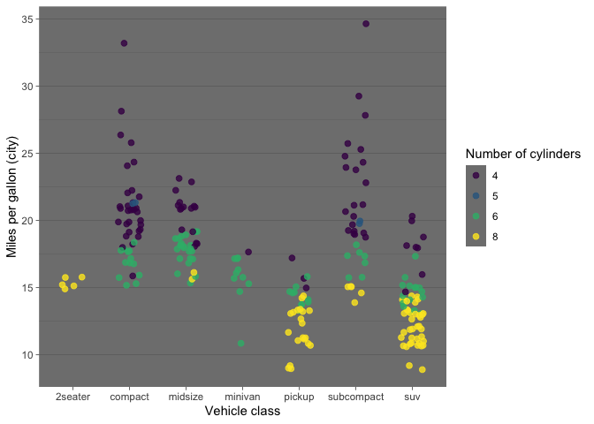

Homework 2
================

Here I am using the `mpg` dataset to investigate how gas mileage varies
among cars of different classes.

``` r
# If it's the first time you've ever used the package:
# install.packages("tidyverse")

# Load the tidyverse
library(tidyverse)
```

The first step is to take a look at the data.

``` r
glimpse(mpg) # A tidyverse way to inspect the tibble
```

    ## Rows: 234
    ## Columns: 11
    ## $ manufacturer <chr> "audi", "audi", "audi", "audi", "audi", "audi", "audi", "…
    ## $ model        <chr> "a4", "a4", "a4", "a4", "a4", "a4", "a4", "a4 quattro", "…
    ## $ displ        <dbl> 1.8, 1.8, 2.0, 2.0, 2.8, 2.8, 3.1, 1.8, 1.8, 2.0, 2.0, 2.…
    ## $ year         <int> 1999, 1999, 2008, 2008, 1999, 1999, 2008, 1999, 1999, 200…
    ## $ cyl          <int> 4, 4, 4, 4, 6, 6, 6, 4, 4, 4, 4, 6, 6, 6, 6, 6, 6, 8, 8, …
    ## $ trans        <chr> "auto(l5)", "manual(m5)", "manual(m6)", "auto(av)", "auto…
    ## $ drv          <chr> "f", "f", "f", "f", "f", "f", "f", "4", "4", "4", "4", "4…
    ## $ cty          <int> 18, 21, 20, 21, 16, 18, 18, 18, 16, 20, 19, 15, 17, 17, 1…
    ## $ hwy          <int> 29, 29, 31, 30, 26, 26, 27, 26, 25, 28, 27, 25, 25, 25, 2…
    ## $ fl           <chr> "p", "p", "p", "p", "p", "p", "p", "p", "p", "p", "p", "p…
    ## $ class        <chr> "compact", "compact", "compact", "compact", "compact", "c…

Next I plot mileage against vehicle class. I also consider the number of
cylinders, since this a variable that affects mileage and varies among
vehicle classes.

``` r
ggplot (data = mpg) +
  geom_jitter(mapping = aes(x=class, y=cty, color = as.character(cyl)), alpha=.8, size=2, width = .2) +
  scale_color_ordinal() +
  theme_dark() +
  theme(panel.grid.major.x = element_blank()) +
  labs(
    color = "Number of cylinders",
    x = "Vehicle class",
    y = "Miles per gallon (city)"
  )
```

<!-- -->

This plot indicates that there are distinct patterns in the mileage of
different vehicle classes, though there is overlap among all classes.
For instance, the worst gas mileage is seen in pickup trucks and SUVs
and the best in compact and subcompact cars. However, from looking at
this plot I would probably conclude that the number of cylinders is a
more important determinant of gas mileage than vehicle class.
