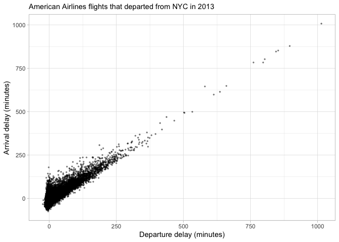

Homework 4
================

## Setup

``` r
library(tidyverse)
```

    ## ── Attaching packages ─────────────────────────────────────── tidyverse 1.3.1 ──

    ## ✓ ggplot2 3.3.5     ✓ purrr   0.3.4
    ## ✓ tibble  3.1.4     ✓ dplyr   1.0.7
    ## ✓ tidyr   1.1.3     ✓ stringr 1.4.0
    ## ✓ readr   2.0.1     ✓ forcats 0.5.1

    ## ── Conflicts ────────────────────────────────────────── tidyverse_conflicts() ──
    ## x dplyr::filter() masks stats::filter()
    ## x dplyr::lag()    masks stats::lag()

``` r
library(nycflights13)
```

## Exercises

#### Exercise 1

``` r
a <- 3  ## a gets the value 3
b <- 2  ## b gets the value 2
a+b  ## print a + b
```

    ## [1] 5

#### Exercise 2

``` r
sum(a,b)
```

    ## [1] 5

#### Exercise 3

First I subset the `flights` dataframe using the `dplyr` function
`filter()`.

``` r
(AA_flights <- filter(flights, carrier == "AA"))  ## creates a new dataframe with only American Airlines flights
```

    ## # A tibble: 32,729 × 19
    ##     year month   day dep_time sched_dep_time dep_delay arr_time sched_arr_time
    ##    <int> <int> <int>    <int>          <int>     <dbl>    <int>          <int>
    ##  1  2013     1     1      542            540         2      923            850
    ##  2  2013     1     1      558            600        -2      753            745
    ##  3  2013     1     1      559            600        -1      941            910
    ##  4  2013     1     1      606            610        -4      858            910
    ##  5  2013     1     1      623            610        13      920            915
    ##  6  2013     1     1      628            630        -2     1137           1140
    ##  7  2013     1     1      629            630        -1      824            810
    ##  8  2013     1     1      635            635         0     1028            940
    ##  9  2013     1     1      656            700        -4      854            850
    ## 10  2013     1     1      656            659        -3      949            959
    ## # … with 32,719 more rows, and 11 more variables: arr_delay <dbl>,
    ## #   carrier <chr>, flight <int>, tailnum <chr>, origin <chr>, dest <chr>,
    ## #   air_time <dbl>, distance <dbl>, hour <dbl>, minute <dbl>, time_hour <dttm>

Now I can make a scatterplot of arrival delay versus departure delay for
only American Airlines flights:

``` r
ggplot(data = AA_flights) +
  geom_point(mapping = aes(x = dep_delay, y = arr_delay), size = 0.5 ,alpha = 0.4) +
  labs(subtitle = "American Airlines flights that departed from NYC in 2013",
       x = "Departure delay (minutes)", 
       y = "Arrival delay (minutes)") +
  theme_light()
```

    ## Warning: Removed 782 rows containing missing values (geom_point).

<!-- -->
