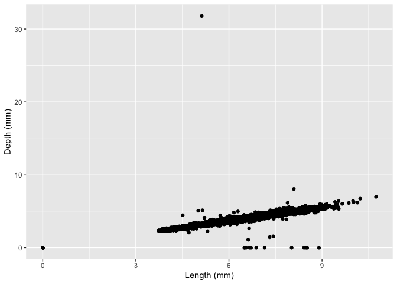

Homework 5
================

### Setup

``` r
# Load the tidyverse
library(tidyverse) 
```

    ## ── Attaching packages ─────────────────────────────────────── tidyverse 1.3.1 ──

    ## ✓ ggplot2 3.3.5     ✓ purrr   0.3.4
    ## ✓ tibble  3.1.4     ✓ dplyr   1.0.7
    ## ✓ tidyr   1.1.3     ✓ stringr 1.4.0
    ## ✓ readr   2.0.1     ✓ forcats 0.5.1

    ## ── Conflicts ────────────────────────────────────────── tidyverse_conflicts() ──
    ## x dplyr::filter() masks stats::filter()
    ## x dplyr::lag()    masks stats::lag()

``` r
# Look at the data
glimpse(diamonds)
```

    ## Rows: 53,940
    ## Columns: 10
    ## $ carat   <dbl> 0.23, 0.21, 0.23, 0.29, 0.31, 0.24, 0.24, 0.26, 0.22, 0.23, 0.…
    ## $ cut     <ord> Ideal, Premium, Good, Premium, Good, Very Good, Very Good, Ver…
    ## $ color   <ord> E, E, E, I, J, J, I, H, E, H, J, J, F, J, E, E, I, J, J, J, I,…
    ## $ clarity <ord> SI2, SI1, VS1, VS2, SI2, VVS2, VVS1, SI1, VS2, VS1, SI1, VS1, …
    ## $ depth   <dbl> 61.5, 59.8, 56.9, 62.4, 63.3, 62.8, 62.3, 61.9, 65.1, 59.4, 64…
    ## $ table   <dbl> 55, 61, 65, 58, 58, 57, 57, 55, 61, 61, 55, 56, 61, 54, 62, 58…
    ## $ price   <int> 326, 326, 327, 334, 335, 336, 336, 337, 337, 338, 339, 340, 34…
    ## $ x       <dbl> 3.95, 3.89, 4.05, 4.20, 4.34, 3.94, 3.95, 4.07, 3.87, 4.00, 4.…
    ## $ y       <dbl> 3.98, 3.84, 4.07, 4.23, 4.35, 3.96, 3.98, 4.11, 3.78, 4.05, 4.…
    ## $ z       <dbl> 2.43, 2.31, 2.31, 2.63, 2.75, 2.48, 2.47, 2.53, 2.49, 2.39, 2.…

### 1. Print a data frame that contains the simple count of diamonds in each cut

``` r
# count(group_by(diamonds,cut))
# piped:
cut_summary <- diamonds %>%
                group_by(cut) %>%
                  count()
cut_summary
```

    ## # A tibble: 5 × 2
    ## # Groups:   cut [5]
    ##   cut           n
    ##   <ord>     <int>
    ## 1 Fair       1610
    ## 2 Good       4906
    ## 3 Very Good 12082
    ## 4 Premium   13791
    ## 5 Ideal     21551

### 2. Use dplyr to create a df that contains 1% of the rows of `diamonds`, randomly subsetted

``` r
random_subset <- diamonds %>%
                  slice_sample(prop = 0.01) 
# slices out a random selection of rows, 0.01 the size of the original data frame

glimpse(random_subset)
```

    ## Rows: 539
    ## Columns: 10
    ## $ carat   <dbl> 0.52, 0.71, 0.34, 0.71, 1.20, 0.50, 0.42, 0.71, 0.32, 0.55, 2.…
    ## $ cut     <ord> Ideal, Premium, Ideal, Ideal, Very Good, Ideal, Very Good, Ide…
    ## $ color   <ord> G, E, F, G, I, G, F, G, D, F, F, G, F, G, D, H, I, F, J, E, E,…
    ## $ clarity <ord> VVS2, SI1, VS1, VS1, VS1, VVS2, SI2, SI1, VS2, SI1, SI2, SI2, …
    ## $ depth   <dbl> 60.8, 61.1, 62.1, 61.7, 63.1, 62.3, 61.5, 61.6, 61.0, 61.7, 63…
    ## $ table   <dbl> 57, 57, 57, 57, 58, 56, 59, 55, 56, 56, 58, 59, 59, 55, 58, 55…
    ## $ price   <int> 2012, 2629, 745, 3431, 5322, 1935, 710, 3007, 972, 1718, 18686…
    ## $ x       <dbl> 5.21, 5.73, 4.49, 5.70, 6.70, 5.09, 4.81, 5.72, 4.46, 5.30, 8.…
    ## $ y       <dbl> 5.16, 5.69, 4.53, 5.75, 6.62, 5.05, 4.85, 5.78, 4.42, 5.26, 8.…
    ## $ z       <dbl> 3.15, 3.49, 2.80, 3.53, 4.20, 3.16, 2.97, 3.54, 2.71, 3.25, 5.…

### 3. Calculate the average size of the 100 largest diamonds in each clarity category

``` r
largest.by.clarity <- diamonds %>%
                      group_by(clarity) %>%
                      slice_max(carat, n = 100, with_ties = FALSE) %>%  # takes the 100 top values by carat
                      summarise(mean.size = mean(carat, na.rm = TRUE))  # makes a summary df of average carats

largest.by.clarity
```

    ## # A tibble: 8 × 2
    ##   clarity mean.size
    ##   <ord>       <dbl>
    ## 1 I1           2.51
    ## 2 SI2          2.62
    ## 3 SI1          2.30
    ## 4 VS2          2.23
    ## 5 VS1          2.10
    ## 6 VVS2         1.66
    ## 7 VVS1         1.51
    ## 8 IF           1.40

### 4. Make scatterplots of dimensions

``` r
# First, a plot of x vs. y
ggplot(diamonds) +
  geom_point(mapping = aes(y = x, x = y)) +
  labs(y = "Length (mm)", x = "Width (mm)")
```

<!-- -->

``` r
# Next, a plot of x vs. z
ggplot(diamonds) +
  geom_point(mapping = aes(y = x, x = z)) +
  labs(y = "Length (mm)", x = "Depth (mm)")
```

<!-- -->

### 5. Create a new data frame, with these questionable points removed

``` r
sans_outliers <- diamonds %>%
                  filter(x > 3 & y < 50 & z < 30) # filtering out the most extreme outliers in the plots above
```

I left some less extreme outliers because I dunno what’s normal for
diamonds. Maybe they can be long and skinny like a hotdog? I doubt it
but I do hope so
