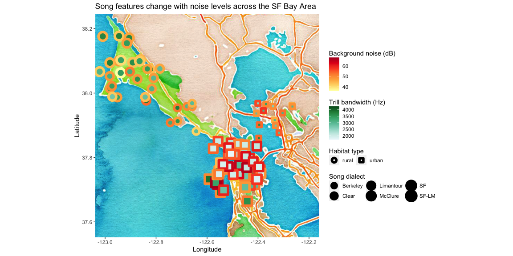

Homework 7: BAD PLOT!
================

## Bad plot

``` r
library(tidyverse)
library(ggmap)

## Import data
data <- read.csv("hw_7_data.csv")
glimpse(data)
```

    ## Rows: 93
    ## Columns: 14
    ## $ Band.Numbe     <int> 144100566, 277110618, 277110619, 266127820, 144100539, …
    ## $ Laeq           <dbl> 45.70000, 43.60000, 53.40000, 47.65000, 45.90000, 48.10…
    ## $ num.songs      <int> 1, 1, 10, 10, 1, 1, 1, 3, 5, 10, 1, 1, 10, 6, 10, 10, 1…
    ## $ Age            <int> 5, 5, 5, 5, 5, 5, 5, 5, 5, 5, 5, 4, 5, 4, 5, 5, 4, 5, 5…
    ## $ Location       <chr> "RICH", "LIMA", "LIMA", "ABLA", "FOFU", "LIMA", "FOFU",…
    ## $ Dialect        <chr> "Berkeley", "Limantour", "Limantour", "McClure", "SF-LM…
    ## $ Type           <chr> "urban", "rural", "rural", "rural", "urban", "rural", "…
    ## $ NORTH.COOR     <dbl> 37.90880, 38.02654, 38.02740, 38.12130, 37.72398, 38.02…
    ## $ WEST.COORD     <dbl> -122.3504, -122.8836, -122.8908, -122.9420, -122.5046, …
    ## $ trill.bw       <dbl> 4253.800, 3826.700, 3849.409, 3884.490, 3856.500, 3710.…
    ## $ trill.rate     <dbl> 7.684033, 11.463508, 10.700422, 9.332414, 9.011039, 12.…
    ## $ body.condition <dbl> 28.79985, 33.08541, 32.70637, 34.93203, 33.23835, 31.57…
    ## $ deviation      <dbl> 18.90000, 18.56250, 26.26361, 20.22700, 20.77000, 18.80…
    ## $ all.dev        <dbl> -6.73, -2.11, -1.79, -1.11, -0.24, -0.51, 2.23, 2.53, 0…

``` r
## Get map
bad.map <- good.map <- get_map(center=c(-122.6, 37.9), source = "stamen", maptype = "watercolor", zoom =10)

## Plot data
ggmap(bad.map)  +
  geom_point(data = data, mapping = aes(x = jitter(WEST.COORD, amount = .1), y = jitter(NORTH.COOR, amount = .06), color = Laeq, fill = trill.bw, shape = Type, size = Dialect), stroke = 3) +
  scale_shape_manual(values = c(21, 22)) +
  scale_colour_distiller(palette = "YlOrRd", direction = 1) +
  scale_fill_distiller(palette = "BuGn", direction = 1)
```

<!-- -->

## Marginally better plot

``` r
## Setup
library(tidyverse)
library(ggmap)
library(cowplot)

## Create a summary data frame -- mean background noise for each dialect
dialect.summary <- data %>%
  group_by(Dialect) %>%
  summarize(mean = mean(Laeq), lon = mean(WEST.COORD), lat = mean(NORTH.COOR))
glimpse (dialect.summary)
```

    ## Rows: 6
    ## Columns: 4
    ## $ Dialect <chr> "Berkeley", "Clear", "Limantour", "McClure", "SF", "SF-LM"
    ## $ mean    <dbl> 51.28929, 48.20000, 47.56832, 43.53472, 56.00357, 55.15789
    ## $ lon     <dbl> -122.3435, -122.7240, -122.8828, -122.9448, -122.4751, -122.50…
    ## $ lat     <dbl> 37.90985, 37.91065, 38.02837, 38.12043, 37.80025, 37.71755

``` r
## Make maps! One for each dialect. Would be easier in qGIS
presidio <- ggmap(get_map(center=c(-122.4751, 37.80025), source = "stamen", maptype = "toner-lite", zoom = 15))
lame <- ggmap(get_map(center=c(-122.5015, 37.71755), source = "stamen", maptype = "toner-lite", zoom = 15))
richmond <- ggmap(get_map(center=c(-122.3435, 37.90985), source = "stamen", maptype = "toner-lite", zoom = 15))
commonweal <- ggmap(get_map(center=c(-122.7240, 37.91065), source = "stamen", maptype = "toner-lite", zoom = 15))
limantour <- ggmap(get_map(center=c(-122.8828, 38.02837), source = "stamen", maptype = "toner-lite", zoom = 15))
abla  <- ggmap(get_map(center=c(-122.9448, 38.12043), source = "stamen", maptype = "toner-lite", zoom = 15))


SF <- presidio +
  geom_point(data = data, mapping = aes(x = WEST.COORD, y = NORTH.COOR, color = trill.bw), size = 2.5) +
  scale_color_distiller(palette = "OrRd") +
  theme(axis.ticks = element_blank(), axis.text = element_blank(), axis.title.x = element_blank(), legend.position = "none") +
  labs(title = "San Francisco", subtitle = "Mean noise (dB) = 56.00", y = "URBAN")

SF.LM <- lame +
  geom_point(data = data, mapping = aes(x = WEST.COORD, y = NORTH.COOR, color = trill.bw), size = 2.5) +
  scale_color_distiller(palette = "OrRd") +
  theme(axis.ticks = element_blank(), axis.text = element_blank(), axis.title.x = element_blank(), legend.position = "none") +
  labs(title = "Lake Merced", subtitle = "Mean noise (dB) = 55.16", y = "")

berkeley <- richmond +
  geom_point(data = data, mapping = aes(x = WEST.COORD, y = NORTH.COOR, color = trill.bw), size = 2.5) +
  scale_color_distiller(palette = "OrRd") +
  theme(axis.ticks = element_blank(), axis.text = element_blank(), axis.title.x = element_blank(), legend.position = "none") +
  labs(title = "Berkeley", subtitle = "Mean noise (dB) = 51.29", y = "")

clear <- commonweal +
  geom_point(data = data, mapping = aes(x = WEST.COORD, y = NORTH.COOR, color = trill.bw), size = 2.5) +
  scale_color_distiller(palette = "OrRd") +
  theme(axis.ticks = element_blank(), axis.text = element_blank(), axis.title.x = element_blank(), legend.position = "none") +
  labs(title = "Clear", subtitle = "Mean noise (dB) = 48.20", y = "RURAL")

lima <- limantour +
  geom_point(data = data, mapping = aes(x = WEST.COORD, y = NORTH.COOR, color = trill.bw), size = 2.5) +
  scale_color_distiller(palette = "OrRd") +
  theme(axis.ticks = element_blank(), axis.text = element_blank(), axis.title.x = element_blank(), legend.position = "none") +
  labs(title = "Limantour", subtitle = "Mean noise (dB) = 47.57", y = "")

mcclure <- abla +
  geom_point(data = data, mapping = aes(x = WEST.COORD, y = NORTH.COOR, color = trill.bw), size = 2.5) +
  scale_color_distiller(palette = "OrRd") +
  theme(axis.ticks = element_blank(), axis.text = element_blank(), axis.title.x = element_blank(), legend.position = "none") +
  labs(title = "McClure", subtitle = "Mean noise (dB) = 43.53", y = "")


## A dummy plot to extract the legend from...
dummyplot <- ggplot(data, aes(x = WEST.COORD, y = NORTH.COOR, color = trill.bw)) +
  geom_point() +
  scale_color_distiller(palette = "OrRd", name = str_wrap("Trill bandwidth (Hz)", width = 3))


## Can't facet wrap this, so I'm arranging with ggdraw and the package cowplot
toprow <- plot_grid(SF, SF.LM, berkeley, align = "h", axis = "bt", ncol = 3)
bottomrow <- plot_grid(clear, lima, mcclure, align = "h", axis = "bt", ncol = 3)

legend <- get_legend(dummyplot)

ggdraw(plot_grid(plot_grid(toprow, bottomrow, ncol=1, align='v'),
                 plot_grid(NULL, legend, ncol=1),
                 rel_widths=c(1, .15), greedy = FALSE))
```

<!-- -->
