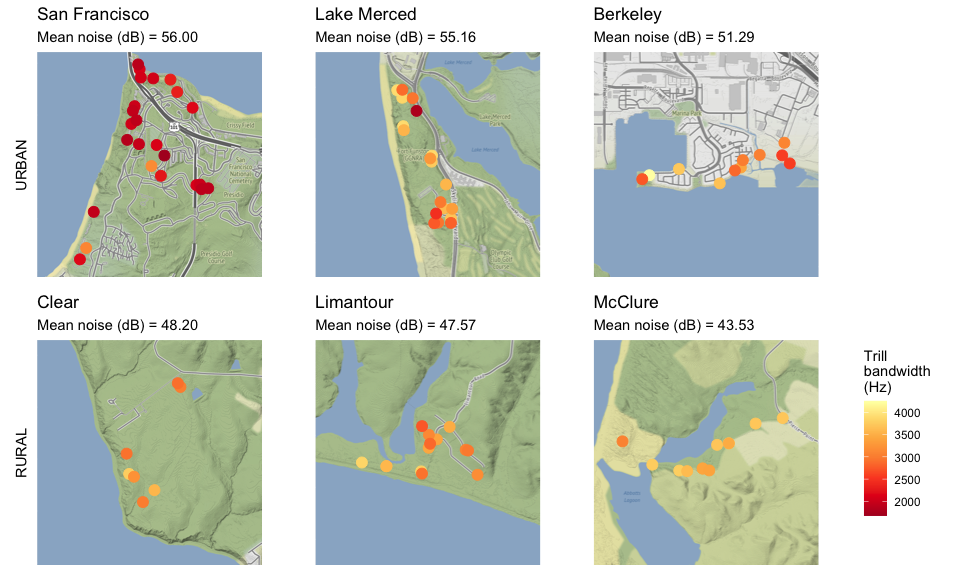

Homework 7
================

## Bad plot

I’ll be visualizing some data from my study system in the San Francisco
Bay Area. We have recorded the songs of white-crowned sparrows in both
urban San Francisco and neighboring rural Point Reyes National Seashore,
and measured the background noise level on each bird’s territory. Each
study site is home to a different song dialect (i.e. discrete cultural
population).

``` r
library(tidyverse)
library(ggmap)

## Import data
data <- read.csv("hw_7_data.csv")
glimpse(data)
```

    ## Rows: 93
    ## Columns: 14
    ## $ Band.Numbe     <int> 144100566, 277110618, 277110619, 266127820, 144100539, …
    ## $ Laeq           <dbl> 45.70000, 43.60000, 53.40000, 47.65000, 45.90000, 48.10…
    ## $ num.songs      <int> 1, 1, 10, 10, 1, 1, 1, 3, 5, 10, 1, 1, 10, 6, 10, 10, 1…
    ## $ Age            <int> 5, 5, 5, 5, 5, 5, 5, 5, 5, 5, 5, 4, 5, 4, 5, 5, 4, 5, 5…
    ## $ Location       <chr> "RICH", "LIMA", "LIMA", "ABLA", "FOFU", "LIMA", "FOFU",…
    ## $ Dialect        <chr> "Berkeley", "Limantour", "Limantour", "McClure", "SF-LM…
    ## $ Type           <chr> "urban", "rural", "rural", "rural", "urban", "rural", "…
    ## $ NORTH.COOR     <dbl> 37.90880, 38.02654, 38.02740, 38.12130, 37.72398, 38.02…
    ## $ WEST.COORD     <dbl> -122.3504, -122.8836, -122.8908, -122.9420, -122.5046, …
    ## $ trill.bw       <dbl> 4253.800, 3826.700, 3849.409, 3884.490, 3856.500, 3710.…
    ## $ trill.rate     <dbl> 7.684033, 11.463508, 10.700422, 9.332414, 9.011039, 12.…
    ## $ body.condition <dbl> 28.79985, 33.08541, 32.70637, 34.93203, 33.23835, 31.57…
    ## $ deviation      <dbl> 18.90000, 18.56250, 26.26361, 20.22700, 20.77000, 18.80…
    ## $ all.dev        <dbl> -6.73, -2.11, -1.79, -1.11, -0.24, -0.51, 2.23, 2.53, 0…

``` r
## Get map
bad.map <- get_map(center=c(-122.6, 37.9), source = "stamen", maptype = "watercolor", zoom =10)

## Plot data
ggmap(bad.map)  +
  geom_point(data = data, mapping = aes(x = jitter(WEST.COORD, amount = .1), y = jitter(NORTH.COOR, amount = .06), color = Laeq, fill = trill.bw, shape = Type, size = Dialect), stroke = 3) +
  scale_shape_manual(values = c(21, 22)) +
  scale_colour_distiller(palette = "YlOrRd", direction = 1) +
  scale_fill_distiller(palette = "BuGn", direction = 1) +
  labs(color = "Background noise (dB)", 
       fill = "Trill bandwidth (Hz)", 
       shape = "Habitat type", 
       size = "Song dialect",
       y = "Latitude",
       x = "Longitude",
       title = "Song features change with noise levels across the SF Bay Area") +
  theme(legend.spacing.y = unit(.08, "cm")) +
  guides(size = guide_legend(ncol = 3),
         shape = guide_legend(ncol = 2),
         color = guide_colorbar(barheight = unit(2, "cm")),
         fill = guide_colorbar(barheight = unit(2, "cm")))
```

<!-- -->

#### Analysis

The gimmicky watercolor map was *probably* not the best choice. It lacks
detail and the colors are garish.

There are too many aesthetic mappings for the map data to be at all
comprehensible; not only is point position mapped to latitude and
longitude, but each point also has a **shape** mapping (habitat type),
**size** mapping (song dialect), and not one but **two color** mappings
– an inner fill color mapped to trill bandwidth, and an outline color
mapped to background noise.

Though it would be acceptable to map either trill bandwidth or
background noise to a continuous color scale, the color combination is
difficult to interpret (and to look at). The colors chosen for these two
color scales are not only as unfriendly as possible to colorblind
viewers, but also unhelpfully match the over-the-top map colors.

The shape mapping is pointless, as the habitat types do not overlap
anywhere on the map.

The size mapping is an absolutely terrible choice to distinguish among
song dialects, which are unordered factor levels. Not only does the size
scale give a false impression of both ordered and continuous data, but
it’s also impossible to distinguish most of the sizes. The large size of
many of the points also exacerbates the bad overplotting.

The greatest sin in this horrible graphic is the way it addresses
overplotting: it jitters the points. While slight jitter may be
appropriate in a scatterplot, datapoints on a map are supposed to accord
with an actual geographical position and jittering them is a dishonest
representation of the data. Moreover, good jitter is supposed to happen
on a small enough scale that it doesn’t alter the interpretation of the
data. Here the points are jittered by as much as 0.1 degrees – the
equivalent of nearly seven miles. This makes it look as though birds
were sampled continuously across the Bay Area (including, apparently, in
the Pacific Ocean), when in reality they were sampled from 6 discrete
study sites.

## Marginally better plot

The premise of this plot isn’t great, as it’s probably too much data to
include in one figure, but let’s try to fix it.

Unjittered, the points wouldn’t show up clearly at this scale, since
they’re concentrated in 6 small study sites. I’ll therefore facet the
map into 6 more zoomed-in maps of these study sites. Of course, I will
change the base map to something less gaudy and more informative. I’ll
pull out the aesthetic mappings for habitat type (urban/rural), song
dialect, and background noise and instead include them as a text label
on the faceted grid.

``` r
## Setup
library(tidyverse)
library(ggmap)
library(cowplot)

## Create a summary data frame -- mean background noise for each dialect
dialect.summary <- data %>%
  group_by(Dialect) %>%
  summarize(mean = mean(Laeq), lon = mean(WEST.COORD), lat = mean(NORTH.COOR))
glimpse (dialect.summary)
```

    ## Rows: 6
    ## Columns: 4
    ## $ Dialect <chr> "Berkeley", "Clear", "Limantour", "McClure", "SF", "SF-LM"
    ## $ mean    <dbl> 51.28929, 48.20000, 47.56832, 43.53472, 56.00357, 55.15789
    ## $ lon     <dbl> -122.3435, -122.7240, -122.8828, -122.9448, -122.4751, -122.50…
    ## $ lat     <dbl> 37.90985, 37.91065, 38.02837, 38.12043, 37.80025, 37.71755

``` r
## Make maps! One for each dialect. Would be easier in qGIS
presidio <- ggmap(get_map(center=c(-122.4751, 37.80025), source = "stamen", maptype = "terrain", zoom = 15))
lame <- ggmap(get_map(center=c(-122.5015, 37.71755), source = "stamen", maptype = "terrain", zoom = 15))
richmond <- ggmap(get_map(center=c(-122.3435, 37.90985), source = "stamen", maptype = "terrain", zoom = 15))
commonweal <- ggmap(get_map(center=c(-122.7240, 37.91065), source = "stamen", maptype = "terrain", zoom = 15))
limantour <- ggmap(get_map(center=c(-122.8828, 38.02837), source = "stamen", maptype = "terrain", zoom = 15))
abla  <- ggmap(get_map(center=c(-122.9448, 38.12043), source = "stamen", maptype = "terrain", zoom = 15))


SF <- presidio +
  geom_point(data = data, mapping = aes(x = WEST.COORD, y = NORTH.COOR, color = trill.bw), size = 3.5) +
  scale_color_distiller(palette = "YlOrRd") +
  theme(axis.ticks = element_blank(), axis.text = element_blank(), axis.title.x = element_blank(), legend.position = "none") +
  labs(title = "San Francisco", subtitle = "Mean noise (dB) = 56.00", y = "URBAN")

SF.LM <- lame +
  geom_point(data = data, mapping = aes(x = WEST.COORD, y = NORTH.COOR, color = trill.bw), size = 3.5) +
  scale_color_distiller(palette = "YlOrRd") +
  theme(axis.ticks = element_blank(), axis.text = element_blank(), axis.title.x = element_blank(), legend.position = "none") +
  labs(title = "Lake Merced", subtitle = "Mean noise (dB) = 55.16", y = "")

berkeley <- richmond +
  geom_point(data = data, mapping = aes(x = WEST.COORD, y = NORTH.COOR, color = trill.bw), size = 3.5) +
  scale_color_distiller(palette = "YlOrRd") +
  theme(axis.ticks = element_blank(), axis.text = element_blank(), axis.title.x = element_blank(), legend.position = "none") +
  labs(title = "Berkeley", subtitle = "Mean noise (dB) = 51.29", y = "")

clear <- commonweal +
  geom_point(data = data, mapping = aes(x = WEST.COORD, y = NORTH.COOR, color = trill.bw), size = 3.5) +
  scale_color_distiller(palette = "YlOrRd") +
  theme(axis.ticks = element_blank(), axis.text = element_blank(), axis.title.x = element_blank(), legend.position = "none") +
  labs(title = "Clear", subtitle = "Mean noise (dB) = 48.20", y = "RURAL")

lima <- limantour +
  geom_point(data = data, mapping = aes(x = WEST.COORD, y = NORTH.COOR, color = trill.bw), size = 3.5) +
  scale_color_distiller(palette = "YlOrRd") +
  theme(axis.ticks = element_blank(), axis.text = element_blank(), axis.title.x = element_blank(), legend.position = "none") +
  labs(title = "Limantour", subtitle = "Mean noise (dB) = 47.57", y = "")

mcclure <- abla +
  geom_point(data = data, mapping = aes(x = WEST.COORD, y = NORTH.COOR, color = trill.bw), size = 3.5) +
  scale_color_distiller(palette = "YlOrRd") +
  theme(axis.ticks = element_blank(), axis.text = element_blank(), axis.title.x = element_blank(), legend.position = "none") +
  labs(title = "McClure", subtitle = "Mean noise (dB) = 43.53", y = "")


## A dummy plot to extract the legend from...
dummyplot <- ggplot(data, aes(x = WEST.COORD, y = NORTH.COOR, color = trill.bw)) +
  geom_point() +
  scale_color_distiller(palette = "YlOrRd", name = str_wrap("Trill bandwidth (Hz)", width = 3))


## Can't facet wrap this, so I'm arranging with ggdraw and the package cowplot
toprow <- plot_grid(SF, SF.LM, berkeley, align = "h", axis = "bt", ncol = 3)
bottomrow <- plot_grid(clear, lima, mcclure, align = "h", axis = "bt", ncol = 3)

legend <- get_legend(dummyplot)

ggdraw(plot_grid(plot_grid(toprow, bottomrow, ncol=1, align='v'),
                 plot_grid(NULL, legend, ncol=1),
                 rel_widths=c(1, .15), greedy = FALSE))
```

<!-- -->
