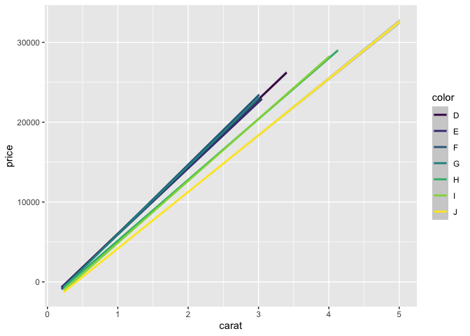
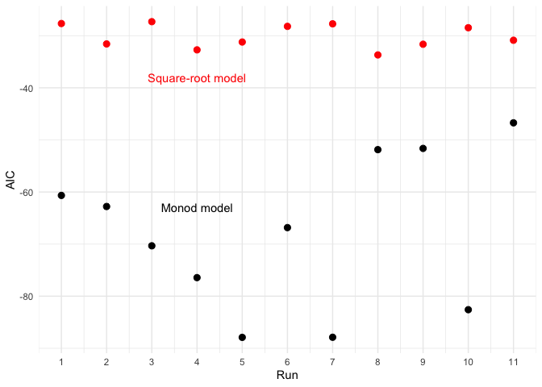
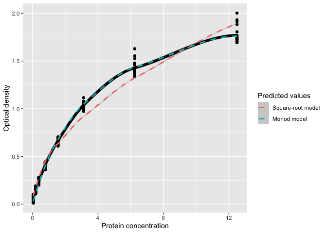

Homework 8
================

## Question 1

Using the `diamonds` data set, make a data frame that shows the slope of
the relationship of price as a function of weight (carat) for each
unique color, in decreasing order of slope.

Visualizing as a first step, to conceptualize what I’m supposed to do

``` r
 ggplot(diamonds) +
  geom_smooth(aes(x = carat,
                  y = price,
                  color = color),
              method = lm)
```

<!-- -->

Make the data frame:

``` r
# Nest data (each row is a group)
by_color <- diamonds %>%
  group_by(color) %>%
  nest()

# Make a function that runs the model I want
price.carat.model <- function(df) {
  lm(price ~ carat, data = df)
}

# Apply the function to every group in my nested data frame
models <- map(by_color$data, price.carat.model)

# Add the list of models to my data frame
by_color <- by_color %>%
  mutate(model = map(data, price.carat.model))
by_color
```

    ## # A tibble: 7 × 3
    ## # Groups:   color [7]
    ##   color data                  model 
    ##   <ord> <list>                <list>
    ## 1 E     <tibble [9,797 × 9]>  <lm>  
    ## 2 I     <tibble [5,422 × 9]>  <lm>  
    ## 3 J     <tibble [2,808 × 9]>  <lm>  
    ## 4 H     <tibble [8,304 × 9]>  <lm>  
    ## 5 F     <tibble [9,542 × 9]>  <lm>  
    ## 6 G     <tibble [11,292 × 9]> <lm>  
    ## 7 D     <tibble [6,775 × 9]>  <lm>

``` r
# Expand the model contents into columns
model_by_color <- by_color %>%
  mutate(tidy = map(model, broom::tidy)) %>%
  unnest(tidy, .drop = TRUE) %>%
  filter(term == "carat")
model_by_color
```

    ## # A tibble: 7 × 8
    ## # Groups:   color [7]
    ##   color data                  model  term  estimate std.error statistic p.value
    ##   <ord> <list>                <list> <chr>    <dbl>     <dbl>     <dbl>   <dbl>
    ## 1 E     <tibble [9,797 × 9]>  <lm>   carat    8296.      37.1      223.       0
    ## 2 I     <tibble [5,422 × 9]>  <lm>   carat    7761.      34.0      229.       0
    ## 3 J     <tibble [2,808 × 9]>  <lm>   carat    7094.      42.9      165.       0
    ## 4 H     <tibble [8,304 × 9]>  <lm>   carat    7619.      29.8      256.       0
    ## 5 F     <tibble [9,542 × 9]>  <lm>   carat    8677.      40.1      216.       0
    ## 6 G     <tibble [11,292 × 9]> <lm>   carat    8525.      32.0      267.       0
    ## 7 D     <tibble [6,775 × 9]>  <lm>   carat    8408.      49.3      171.       0

``` r
# Create final data frame
model_by_color %>%
  summarise(price.per.carat = estimate) %>%
  arrange(desc(price.per.carat))
```

    ## # A tibble: 7 × 2
    ##   color price.per.carat
    ##   <ord>           <dbl>
    ## 1 F               8677.
    ## 2 G               8525.
    ## 3 D               8408.
    ## 4 E               8296.
    ## 5 I               7761.
    ## 6 H               7619.
    ## 7 J               7094.

## Question 2: nonlinear least squares models

### Fitting nonlinear models

``` r
library(nls2) ## "Non-linear regression with brute force"
```

    ## Loading required package: proto

``` r
data("DNase") ## ELISA band optical density as a function of protein concentration, for 12 different runs
glimpse(DNase)
```

    ## Rows: 176
    ## Columns: 3
    ## $ Run     <ord> 1, 1, 1, 1, 1, 1, 1, 1, 1, 1, 1, 1, 1, 1, 1, 1, 2, 2, 2, 2, 2,…
    ## $ conc    <dbl> 0.04882812, 0.04882812, 0.19531250, 0.19531250, 0.39062500, 0.…
    ## $ density <dbl> 0.017, 0.018, 0.121, 0.124, 0.206, 0.215, 0.377, 0.374, 0.614,…

Visualize the data

``` r
ggplot(DNase) +
  geom_point(aes(x = conc,
                 y = density))
```

<!-- -->

Use list-columns to create a separate square root model and Monod model
for density as a function of concentration, for each run. Extract AIC
scores to evaluate model quality.

``` r
# Nest data
by_run <- DNase %>%
  group_by(Run) %>%
  nest()

# Write functions for the two models
sqrt.mod <- function(df) {
  nls2(formula(density ~ beta_1 * sqrt(conc) + beta_0),
        data = df,
        start = list(beta_1 = 0.5, beta_0 = 0.1))
}

monod.mod <- function(df) {
  nls2(formula(density ~ (conc * beta_1)/(conc + beta_0)),
       data = df,
       start = list(beta_1 = 2, beta_0 = 0.5))
}


# Apply my two models to every group in my data frame

sqrt_models <- map(by_run$data, sqrt.mod)
monod_models <- map(by_run$data, sqrt.mod)

# Add the lists of models to my data frame

by_run <- by_run %>%
  mutate(sqrt.model = map(data, sqrt.mod), 
         monod.model = map(data, monod.mod))
by_run
```

    ## # A tibble: 11 × 4
    ## # Groups:   Run [11]
    ##    Run   data              sqrt.model monod.model
    ##    <ord> <list>            <list>     <list>     
    ##  1 1     <tibble [16 × 2]> <nls>      <nls>      
    ##  2 2     <tibble [16 × 2]> <nls>      <nls>      
    ##  3 3     <tibble [16 × 2]> <nls>      <nls>      
    ##  4 4     <tibble [16 × 2]> <nls>      <nls>      
    ##  5 5     <tibble [16 × 2]> <nls>      <nls>      
    ##  6 6     <tibble [16 × 2]> <nls>      <nls>      
    ##  7 7     <tibble [16 × 2]> <nls>      <nls>      
    ##  8 8     <tibble [16 × 2]> <nls>      <nls>      
    ##  9 9     <tibble [16 × 2]> <nls>      <nls>      
    ## 10 10    <tibble [16 × 2]> <nls>      <nls>      
    ## 11 11    <tibble [16 × 2]> <nls>      <nls>

``` r
# Expand model contents into columns
## Use broom::glance to extract AIC 

models_by_run <- by_run %>%
  mutate(glance.sqrt = map(sqrt.model, broom::glance),
         glance.monod = map(monod.model, broom::glance)) %>%
  unnest(c(glance.sqrt, glance.monod), .drop = TRUE)


summary <- models_by_run %>%
  select(Run, AIC, AIC1)
```

Make a plot of AIC scores for each model for each run

``` r
ggplot(summary) +
  geom_point(aes(x = as.integer(Run), y = AIC), size = 2.5, color = "red") +
  geom_point(aes(x = as.integer(Run), y = AIC1), size = 2.5) +
  annotate("text", x = 4, y = -38, label = "Square-root model", color = "red") +
  annotate("text", x = 4, y = -63, label = "Monod model") +
  scale_x_continuous(name = "Run", breaks = c(1:11)) +
  theme_minimal()
```

<!-- -->

Since the Monod model had lower AIC values than the square-root model
across all the runs, it’s probably a better fit for these data.

## Extra credit

``` r
library(modelr)

m1 <- nls2(formula(density ~ beta_1 * sqrt(conc) + beta_0),
        data = DNase,
        start = list(beta_1 = 0.5, beta_0 = 0.1))

m2 <- nls2(formula(density ~ (conc * beta_1)/(conc + beta_0)),
       data = DNase,
       start = list(beta_1 = 2, beta_0 = 0.5))
        
        
DNase_pred <- DNase %>%
  gather_predictions(m1, m2)


ggplot(data = DNase_pred) +
  geom_point(aes(x = conc, y = density)) +
  geom_smooth(aes(x = conc, y = density), size = 2, color = "black") +
  geom_smooth(aes(x = conc, y = pred, color = model), linetype = "dashed") +
  scale_color_discrete(labels = c("Square-root model","Monod model")) +
  labs(color = "Predicted values",
       x = "Protein concentration",
       y = "Optical density")
```

    ## `geom_smooth()` using method = 'loess' and formula 'y ~ x'
    ## `geom_smooth()` using method = 'loess' and formula 'y ~ x'

<!-- -->
